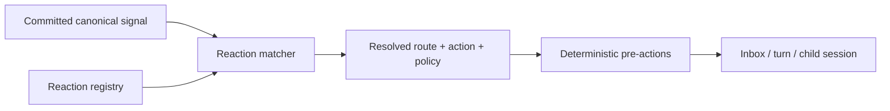

# Reactions and Playbooks

This document defines how Belltower should model reactions to incoming signals and how users should author and register those reactions.

Read it with:

- [`./overview.md`](./overview.md)
- [`./signals-and-ingress.md`](./signals-and-ingress.md)
- [`./memory.md`](./memory.md)
- [`./participants-and-collaboration.md`](./participants-and-collaboration.md)
- [`./subagents-and-session-graphs.md`](./subagents-and-session-graphs.md)
- [`./tool-system-and-normalization.md`](./tool-system-and-normalization.md)
- [`./hooks-and-lifecycle.md`](./hooks-and-lifecycle.md)

It exists because a general-purpose autonomous harness needs more than:

- canonical signals
- routing
- raw prompt text

Belltower also needs a first-class way to express:

- which signals matter
- what work should follow from them
- what deterministic setup should happen before agent work starts
- how users can extend that behavior without writing source code for every new producer

The central architectural rule is:

- signals are canonical inputs
- reactions are registered policies over signals
- playbooks are the user-facing packaging that make reactions easy to author, validate, and share

## Summary

Belltower should have a first-class Reactions subsystem.

That subsystem is responsible for:

- registering reaction objects
- matching reactions against committed canonical signals
- resolving scope and priority
- performing deterministic pre-actions
- routing follow-up work into inboxes, turns, or child sessions
- attaching skills or instruction bundles when agent work starts
- making reaction behavior inspectable and auditable

The reactions layer should be generic enough to work across:

- Semaphora signals
- webhooks
- cron
- messaging channels
- subagents
- local devices

It should not require each producer to invent its own runtime semantics.

## Why this should be first-class

Without first-class reactions, Belltower will tend toward one of three bad patterns:

- policy logic hidden inside producer adapters
- signals collapsed into synthetic user prompts too early
- free-form instruction strings attached ad hoc to bindings

All three make the system harder to reason about.

Reactions give Belltower a clean place to express:

- when to act
- where to send work
- what deterministic setup to perform
- what agent-facing guidance to attach

This preserves the important trust boundary:

- producers emit data
- Belltower owns policy
- agents execute under explicit harness rules

## Core concepts

### Reaction

A reaction is a registered policy object that matches one or more signals and tells Belltower what to do next.

Examples:

- create an inbox item for all Semaphora review-task signals
- auto-start a turn when a watched manuscript file changes
- persist raw device payloads and spawn a child session for analysis
- ignore low-priority webhook events outside working hours

### Matcher

A matcher decides which signals a reaction applies to.

At minimum, it should support:

- producer kind
- signal kind
- binding identity
- session or project scope
- small payload field equality or existence checks

The matcher language should stay intentionally narrow at first.
Do not begin with a giant DSL.

### Action

An action describes the operational result of a matched reaction.

Examples:

- notify
- create inbox item
- queue turn
- start turn
- spawn child session
- reply via binding
- persist artifact
- ignore

### Pre-actions

Pre-actions are deterministic setup steps that happen before agent work begins.

Examples:

- persist raw signal payload
- snapshot attachments
- register an artifact reference
- store a normalized report input bundle
- fetch a bounded memory context bundle with citations

These are harness-level actions, not agent improvisation.

### Instruction references

A reaction may attach:

- a skill
- an instruction bundle
- a prompt template or task framing file

These guide the agent once work starts, but they are not the reaction itself.

### Playbook

A playbook is the user-facing packaged form of one or more reactions.

The point of a playbook is to make reactions:

- readable
- versionable in git
- easy to scaffold
- easy to validate
- easy to test against sample signals

Playbooks should feel similar to skills in ergonomics, but they are not the same semantic object.

## Reactions are not skills

Reactions and skills should compose, but they should not be conflated.

- a reaction decides when to act, where to route, and what deterministic setup to perform
- a skill tells the agent how to do the resulting work

Example:

- reaction
  - on `device.measurement.received`, persist the payload and queue a turn in the analysis session
- skill
  - analyze the new measurement, compare it to prior runs, and update the running report

This split is crucial.

If external producers can effectively inject instructions, the harness loses control over:

- trust boundaries
- auditability
- explainability
- approval policy

This is especially important for memory.

A memory provider should not directly mutate the model-visible prompt or session context by itself.

If a signal-triggered turn needs memory, Belltower should attach it explicitly through reaction-owned setup such as:

- fetch a bounded memory page or neighborhood view
- fetch a citation bundle
- fetch provider-managed review items related to the triggering signal

## Reaction shape

A reaction should remain structured and small.

At minimum it should express:

- `reaction_id`
- `scope`
  - global, project, session, or binding
- `enabled`
- `matcher`
  - producer kind, signal kind, binding, and small payload filters
- `route`
  - inbox, session, project, or child session target
- `action`
  - notify, queue turn, start turn, spawn child session, reply, persist artifact, or ignore
- `pre_actions`
  - deterministic setup such as persisting payloads or attachments
- `instruction_refs`
  - optional skills or instruction bundles to attach
- `policy`
  - dedupe, debounce, rate limits, approval mode, budget, priority

At least in the memory case, `pre_actions` should be able to express bounded context attachment without turning that into a giant new DSL.

## Layering and scope

Reactions should layer cleanly.

At minimum:

- global
  - defaults that apply everywhere unless overridden
- project
  - project-specific operating rules
- session
  - local workflow behavior
- binding
  - one specific Semaphora feed, Slack channel, webhook, cron job, or device

Examples:

- global
  - all Semaphora review-task signals create inbox items
- project
  - figure-change signals for paper X auto-start a review turn
- binding
  - microscope device Y persists every frame payload and spawns an analysis child session

This layering is important because the same signal kind may need different treatment in different scientific workflows.

## Memory-triggered work

Memory-triggered work should be a normal reaction outcome, not a special side channel.

The preferred pattern is:

1. a memory-originated signal is committed
2. one or more reactions match it
3. a reaction creates a work item, queues a turn, or starts a turn
4. if needed, deterministic pre-actions fetch a bounded memory context bundle
5. attached skills or instructions guide the agent through the resulting work

This keeps the system inspectable:

- the provider emitted a signal
- Belltower matched a reaction
- Belltower decided what memory context to attach
- the resulting work entered the normal runtime path

The alternative should be avoided:

- provider emits a signal
- provider also injects arbitrary prompt text
- the operator cannot tell what influenced the model

## Memory context is explicit

The memory context attached by a reaction should be:

- bounded
- attributable to a provider binding
- citation-aware when possible
- inspectable after the fact

That means a memory-aware reaction should generally prefer:

- a page or neighborhood view
- a review-task bundle
- a citation bundle

over:

- raw unbounded provider state
- hidden system prompt edits

## Authoring model

To make reactions easy to write, Belltower should make them feel similar to skills.

That means:

- readable files
- versionable in git
- easy to scaffold
- easy to validate and test with sample signals

But the packaged object should still be a reaction bundle, not just free-form prompt text.

A reasonable first shape is:

```text
reactions/
  update-iot-report/
    REACTION.toml
    instructions.md
    examples/
      sample-signal.json
```

Where:

- `REACTION.toml`
  - structured matcher, route, action, and policy
- `instructions.md`
  - human-readable guidance or attached agent instructions
- `examples/`
  - sample signals used for validation and dry runs

This gives users skill-like ergonomics without losing deterministic harness behavior.

## User registration and testing

Users should be able to register and manage reactions directly.

Conceptually, this should support:

- `bt reaction init`
- `bt reaction validate`
- `bt reaction test`
- `bt reaction register`
- `bt reaction list`
- `bt reaction enable`
- `bt reaction disable`
- `bt reaction explain`

The exact command surface can evolve, but the capability should be first-class.

In particular, users should be able to:

- validate a reaction bundle before it is registered
- test a reaction against sample or real signals
- inspect why a reaction did or did not match
- view which reaction fired for a given signal

## Execution flow

The clean runtime flow is:

1. a producer emits a raw event
2. a binding adapter normalizes it into a canonical signal
3. Belltower commits the signal to the canonical event log
4. reaction matching runs against the committed signal
5. matching reactions are resolved deterministically
6. Belltower emits follow-up canonical events for routing, queuing, spawning, replying, or ignoring
7. if agent work starts, attached skills or instructions are passed through the normal runtime path

This keeps signals inspectable and reactions auditable.

## High-level architecture



## Example patterns

### Semaphora review workflow

- signal
  - `semaphora.review_task.created`
- reaction
  - create inbox item in the mapped project session
- optional attached skill
  - review grounded evidence and decide whether to update the draft or semantic layer

### Semaphora urgent figure-change workflow

- signal
  - `semaphora.action_signal.created`
- reaction
  - start or resume the mapped manuscript-review session
  - fetch a bounded citation bundle for the changed figure and related draft section
  - attach a review skill or instruction bundle
- result
  - a normal Belltower turn with explicit memory context attachment

### IoT or instrument workflow

- signal
  - `device.measurement.received`
- reaction
  - persist raw payload
  - attach the `update-measurement-report` skill
  - queue work into the analysis session
- result
  - a normal Belltower turn with full telemetry and replayable artifacts

### Webhook-driven pipeline

- signal
  - `webhook.analysis.completed`
- reaction
  - register attached artifacts
  - spawn a child session to interpret the result

### Messaging workflow

- signal
  - `message.received`
- reaction
  - route the signal into the mapped shared session
  - usually no special skill is needed because this is participant input, not a machine workflow trigger

## Canonical event implications

The canonical event taxonomy should eventually cover reaction lifecycle and evaluation.

Likely event kinds include:

- `reaction.registered`
- `reaction.updated`
- `reaction.disabled`
- `signal.reaction.matched`
- `signal.reaction.skipped`

The important rule is:

- the system should be able to explain which reactions were considered for a signal and why a given reaction did or did not fire

## Relationship to other subsystems

### Signals

Signals define how canonical external or internal events arrive in Belltower.

Reactions define what Belltower does once those signals have been committed.

Signals are therefore upstream of reactions.

### Participants and collaboration

Reactions may route work into collaborative sessions, but they do not define participant identity or permissions.

That remains the collaboration subsystem's job.

### Subagents and session graphs

One valid reaction action is to spawn a child session.

That does not make the reactions layer responsible for delegated-session modeling.

It simply means reactions may hand work off into that subsystem.

## Recommended rollout

Reactions should land in phases.

### Phase 1. Structured reaction objects

- matcher
- route
- action
- deterministic pre-actions
- enable and disable

### Phase 2. Playbook packaging

- reaction bundles on disk
- validation
- sample-signal testing
- registration and explanation surfaces

### Phase 3. Attached instruction references

- skills
- task framing files
- reusable instruction bundles

### Phase 4. Richer resolution and inspection

- scope layering
- deterministic conflict resolution
- richer explanations and operator inspection

## Non-goals

This subsystem should not:

- let external payloads behave like system instructions
- begin with a giant matcher DSL
- force every producer to invent its own response model
- replace skills
- hide reaction behavior inside opaque adapter code

The goal is a clean, general, and practical policy layer that makes Belltower extensible without sacrificing provenance or control.
