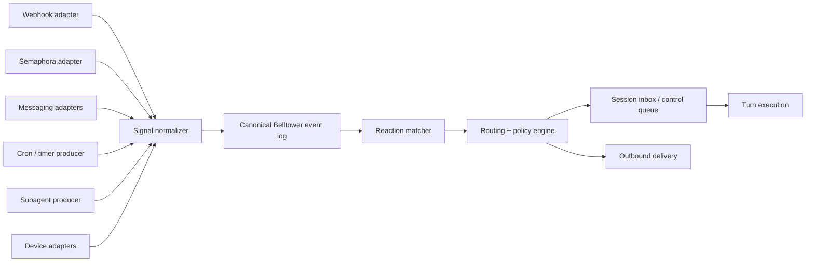

# Signals and Ingress

This document defines the intended shape of Belltower's signal-ingress layer.

Read it with:

- [`./overview.md`](./overview.md)
- [`./memory.md`](./memory.md)
- [`./participants-and-collaboration.md`](./participants-and-collaboration.md)
- [`./reactions-and-playbooks.md`](./reactions-and-playbooks.md)
- [`./event-taxonomy-and-write-path.md`](./event-taxonomy-and-write-path.md)
- [`./subagents-and-session-graphs.md`](./subagents-and-session-graphs.md)
- [`./tool-system-and-normalization.md`](./tool-system-and-normalization.md)
- [`./hooks-and-lifecycle.md`](./hooks-and-lifecycle.md)

It exists because a general autonomous agent cannot rely only on:

- local user prompts
- model-initiated tool calls
- one-shot CLI invocations

Belltower also needs a first-class way to receive signals from:

- external services
- messaging platforms
- memory systems such as Semaphora
- schedules
- subagents
- local devices

The central architectural decision is:

- the subsystem is broader than `subscribe`

`subscribe` is one registration mode inside a larger signals system.

## Summary

Belltower should have a first-class Signals subsystem.

That subsystem is responsible for:

- binding producers to the runtime
- normalizing raw source events into canonical Belltower signals
- persisting those signals in the canonical event log
- matching signals against registered reactions
- routing signals into session inboxes and control queues under reaction policy
- preserving provenance, replay, dedupe, and delivery semantics

This layer should be general enough to support:

- generic webhooks
- Semaphora runtime events
- Slack and WhatsApp
- cron and timers
- subagent completions and requests
- `/dev/*` devices such as serial instruments, microscopes, or controllers

The system should not collapse all of those sources into fake user prompts.

At ingest time they are different things.

## Why this needs to be first-class

Signals are crucial to any agent that operates autonomously.

Without a first-class ingress model, Belltower would be forced into one of two bad patterns:

- each producer becomes its own bespoke integration surface
- external events are converted into synthetic user messages too early

The first leads to integration sprawl.
The second loses provenance, trust boundaries, replay semantics, and policy clarity.

Signals should therefore be treated as a canonical runtime concern in the same way that:

- tool calls
- approvals
- turns
- completions

are canonical runtime concerns.

The other key rule is:

- signals are canonical inputs
- reactions are the registered policies that decide what work follows

Signals should not carry arbitrary instructions from external producers.
Belltower should own the reaction layer itself.

## Core concepts

The signals layer should stay small and explicit.

### Producer

A producer is anything that emits events into Belltower.

Examples:

- a Semaphora server
- a Slack workspace
- a WhatsApp bridge
- a webhook endpoint
- a cron scheduler
- a child session
- a serial-connected device

### Binding

A binding is a configured instance of a producer.

Examples:

- one specific Slack app + workspace
- one Semaphora server for one project
- one webhook route
- one periodic schedule
- one USB microscope feed

Bindings are what users register.

### Signal

A signal is the normalized canonical ingress envelope Belltower stores and routes.

### Reaction

A reaction is a registered policy object that matches one or more signals and tells Belltower what to do next.

Reactions are how users teach Belltower to respond to signals without baking behavior into every adapter.

The full reaction model, authoring surface, and playbook packaging are defined in:

- [`./reactions-and-playbooks.md`](./reactions-and-playbooks.md)

### Route

A route tells Belltower where a signal should go.

Examples:

- a specific session
- a project inbox
- a per-user remote conversation
- a parent session waiting on a child

### Policy

Policy describes how a reaction should behave after it matches.

Examples:

- log only
- create inbox item
- queue work for a session
- auto-start a turn
- interrupt current work
- ignore

### Reply target

Some producers support outbound delivery.

Examples:

- reply into a Slack thread
- answer a webhook callback target
- send a WhatsApp message
- signal a device control path

The reply target should be stored explicitly rather than reconstructed ad hoc.

## Producer classes

The subsystem should support at least these producer classes.

### Remote human

These are human messages that arrive through external channels.

Examples:

- Slack
- WhatsApp
- email
- future SMS or Telegram

These are still human input, but they are not the same thing as local TUI prompt input.

### Remote machine

These are machine-generated external signals.

Examples:

- generic webhooks
- Semaphora events
- CI notifications
- external app callbacks

### Scheduled

These are time-driven signals.

Examples:

- cron jobs
- one-shot reminders
- recurring audits
- delayed follow-ups

### Agent-internal

These are signals produced by Belltower-related runtimes.

Examples:

- subagent started
- subagent finished
- child session needs input
- background task completed

### Local device

These are signals emitted by locally connected devices.

Examples:

- serial devices on `/dev/*`
- USB microscopes
- Arduinos
- button boxes
- sensors and controllers

These should enter Belltower through typed adapters, not raw device bytes exposed directly to the model.

## Base examples

The design should be able to cover these first:

- generic webhook
- Semaphora
- Slack
- WhatsApp
- subagents
- cron
- local device bindings

Additional likely producers later:

- email
- generic SSE streams
- polling adapters for services without webhooks
- calendar or task-system reminders

## Canonical signal envelope

Every producer should normalize into the same base signal shape.

At minimum:

- `signal_id`
- `binding_id`
- `producer_kind`
- `classification`
- `signal_kind`
- `external_key`
- `occurred_at`
- `received_at`
- `summary`
- `payload_json`
- `attachments`
- `routing_hints`
- `reply_target`
- `provenance`

### Classification

Signals should be classified explicitly.

At minimum:

- `human_remote_message`
- `machine_signal`
- `scheduled_signal`
- `agent_signal`
- `device_signal`

This classification must survive in the canonical event log.

### Signal kind

`classification` is broad.
`signal_kind` is the narrower normalized event kind that reactions usually match on.

Examples:

- `message.received`
- `message.edited`
- `semaphora.review_task.created`
- `semaphora.action_signal.created`
- `job.completed`
- `device.measurement.received`
- `device.threshold.triggered`
- `schedule.fired`
- `subagent.completed`

The rule should be:

- `classification` tells Belltower what class of thing arrived
- `signal_kind` tells Belltower what specific normalized event happened

Signal kinds should stay:

- typed
- producer-neutral when possible
- small and inspectable

For example:

- a GitHub webhook about a completed run should ideally normalize to `job.completed`
- a WhatsApp inbound text should normalize to `message.received`
- a Semaphora review task should normalize to `semaphora.review_task.created`

Transport names such as `webhook.received` should only be used when the adapter cannot normalize into a more meaningful signal kind yet.

## Canonical event-log treatment

Signals should not bypass the sacred Belltower write path.

The rule should be:

1. raw source event reaches a producer adapter
2. adapter normalizes it into a canonical signal envelope
3. Belltower commits a canonical signal event to SQLite
4. only then does routing, SSE fanout, or turn scheduling happen

The canonical event kinds will likely include:

- `signal.binding.created`
- `signal.binding.updated`
- `signal.binding.disabled`
- `signal.received`
- `signal.deduped`
- `signal.reaction.matched`
- `signal.reaction.skipped`
- `signal.routed`
- `signal.queued`
- `signal.ignored`
- `signal.delivery.requested`
- `signal.delivery.finished`
- `reaction.registered`
- `reaction.updated`
- `reaction.disabled`

These should be Belltower-owned event kinds, not producer-specific ad hoc strings.

## High-level architecture



## Producer mapping examples

This section makes the producer model concrete.

The important distinction is:

- raw producer event
- adapter
- canonical signal envelope

One producer may emit many different signal kinds.

### Messaging: iMessage and WhatsApp

Yes, an iMessage or WhatsApp message can be a signal.

It should enter Belltower as a signal first, not as a fake local prompt.
If collaboration rules later resolve it to a known remote human participant and route it into a session, that happens after canonical signal commit.

| Source | Raw event shape | Adapter | Classification | Canonical signal kind | Typical payload fields | Reply target |
| --- | --- | --- | --- | --- | --- | --- |
| iMessage | bridge event from a local Messages bridge on macOS | `imessage` adapter | `human_remote_message` | `message.received` | `service`, `chat_id`, `message_id`, `sender_handle`, `text`, `attachments`, `quoted_message_id` | `service`, `chat_id`, `participant_handle` |
| WhatsApp | webhook or bridge callback from WhatsApp provider | `whatsapp` adapter | `human_remote_message` | `message.received` | `account_id`, `chat_id`, `message_id`, `sender_handle`, `text`, `attachments`, `quoted_message_id` | `account_id`, `chat_id`, `recipient_handle` |

Important notes:

- iMessage is architecturally the same as WhatsApp, but the adapter is likely to be a local bridge rather than a clean public bot API.
- a delivery receipt or typing indicator from the same platform would likely normalize to a different signal kind than `message.received`
- message attachments should remain attachments in the canonical envelope, not be flattened into prompt text

### Webhooks

Webhooks are part of the Signals subsystem.
They are not a separate ingress concept.

The clean model is:

- inbound webhook
  - one producer class inside Signals
- outbound webhook callback
  - one reply-capable or delivery-capable transport

| Source | Raw event shape | Adapter | Classification | Canonical signal kind | Typical payload fields | Reply target |
| --- | --- | --- | --- | --- | --- | --- |
| generic webhook | HTTP POST to registered route | `webhook` adapter | `machine_signal` | `webhook.received` or a more specific normalized kind such as `job.completed` | `headers`, `body`, `query`, `remote_ip`, extracted idempotency key | optional callback URL or webhook response target |
| Semaphora SSE / event log | Semaphora runtime event payload | `semaphora` adapter | `machine_signal` | `semaphora.review_task.created`, `semaphora.action_signal.created`, `semaphora.change_event.created` | `resource_id`, `review_task_id`, `action_signal_id`, `change_kind`, event summary | usually none |
| CI callback | provider-specific webhook JSON | CI-specific adapter or generic webhook transform | `machine_signal` | `job.completed`, `job.failed`, `artifact.ready` | `job_id`, `run_id`, `status`, `artifacts`, `branch`, `commit_sha` | optional callback or comment target |

The normalizer should prefer semantic kinds over transport kinds when it can.

For example:

- preferred: `job.completed`
- fallback: `webhook.received`

### Local devices and USB / serial inputs

USB devices and serial-connected devices should also enter through Signals.
They are a device producer class, not special-cased tools.

| Source | Raw event shape | Adapter | Classification | Canonical signal kind | Typical payload fields | Reply target |
| --- | --- | --- | --- | --- | --- | --- |
| serial instrument | framed bytes over `/dev/*` | typed serial adapter | `device_signal` | `device.measurement.received` | `device_id`, `sample_id`, `measurement`, `units`, `timestamp`, optional raw frame | optional device command path |
| USB microscope | captured frame or still image | microscope adapter | `device_signal` | `device.frame.captured` | `device_id`, `frame_id`, capture metadata, attachments | optional device control path |
| button box / sensor | low-level input event | device adapter | `device_signal` | `device.button.pressed`, `device.threshold.triggered`, `device.state.changed` | `device_id`, `control_id`, `state`, `value`, threshold metadata | optional device command path |

Important rules:

- raw bytes should not be exposed directly to the model
- parsing and framing belong in the adapter
- sensing and actuation must remain distinct
- a device command path is a stricter capability than passive signal receipt

### Scheduled and agent-internal signals

| Source | Raw event shape | Adapter | Classification | Canonical signal kind | Typical payload fields | Reply target |
| --- | --- | --- | --- | --- | --- | --- |
| cron / timer | scheduler firing | `schedule` adapter | `scheduled_signal` | `schedule.fired` | `schedule_id`, `scheduled_for`, `missed_run_policy`, `metadata` | none |
| child session | child completion or request event | `subagent` adapter | `agent_signal` | `subagent.completed`, `subagent.input_requested`, `subagent.failed` | `child_session_id`, `parent_session_id`, `result_refs`, `status`, `summary` | route back to parent session or callback target |

### Canonical messaging example

An inbound WhatsApp text should conceptually normalize like this:

```json
{
  "signal_id": "sig_123",
  "binding_id": "bind_whatsapp_project_x",
  "producer_kind": "whatsapp",
  "classification": "human_remote_message",
  "signal_kind": "message.received",
  "external_key": "wamid.HBgL...",
  "occurred_at": "2026-04-03T15:10:00Z",
  "received_at": "2026-04-03T15:10:02Z",
  "summary": "Incoming WhatsApp message from Dr. Smith",
  "payload_json": {
    "chat_id": "whatsapp:+15551234567",
    "sender_handle": "+15551234567",
    "text": "Can you compare Figure 2 to the revised methods section?",
    "quoted_message_id": null
  },
  "attachments": [],
  "routing_hints": {
    "conversation_key": "remote_human:+15551234567",
    "project": "paper-x"
  },
  "reply_target": {
    "transport": "whatsapp",
    "chat_id": "whatsapp:+15551234567"
  },
  "provenance": {
    "adapter": "whatsapp",
    "bridge": "meta-cloud-api"
  }
}
```

The important part is:

- this is still a signal at ingress
- it is not automatically a prompt
- participant resolution and routing happen after commit

## User registration of signals and reactions

Signals and reactions should both be explicitly registrable by users.

That means Belltower should eventually expose first-class surfaces for:

- registering a producer binding
- linking that binding to projects or sessions
- registering one or more reactions against the resulting signal stream
- testing the setup before letting it run live

Conceptually, the user flow should look like:

1. register a binding
2. validate the binding
3. register one or more reactions
4. validate or test those reactions against sample signals
5. enable the setup for live routing

Examples:

- bind a Semaphora event stream, then add reactions for review-task and action-signal events
- bind a webhook route, then add a reaction that starts a child session for relevant payloads
- bind an iMessage or WhatsApp bridge, then map remote conversations to session identities
- bind a serial instrument, then add a reaction that persists raw measurements and updates a running report

This is important because the breadth of possible signals is too large to anticipate exhaustively in built-in code alone.
The harness should provide a strong generic framework and let users extend behavior through registered reactions.

## Clean seams

The subsystem should separate six responsibilities clearly.

### 1. Producer adapters

Adapters handle source-specific concerns:

- auth
- connection lifecycle
- source-specific IDs
- message or payload parsing
- replay cursors
- reconnect behavior
- device framing

Adapters should not decide session policy.

### 2. Signal normalizer

Normalization converts producer-specific payloads into canonical Belltower signals.

This is the seam that prevents the whole system from becoming producer-specific.

### 3. Canonical log

Belltower owns the durable record of received signals.

That means:

- dedupe decisions are visible
- routing decisions are visible
- replay is Belltower-owned
- telemetry and fine-tuning artifacts can see signal provenance

### 4. Reaction registry and matcher

Reactions should be resolved in their own explicit layer.

That layer owns:

- reaction registration
- scope resolution
- matcher evaluation
- deterministic explanation of why a reaction matched or did not match

This keeps producer adapters from becoming policy engines and keeps routing logic from being overloaded with authoring concerns.

### 5. Routing and policy

Routing decides where the signal goes.

Policy decides what happens next.

This layer should decide:

- log only
- create inbox item
- queue for a given session
- auto-start a turn
- interrupt current work
- notify only

### 6. Outbound delivery

If a producer supports replies, outbound delivery should be explicit.

Examples:

- send back to Slack thread
- send to WhatsApp chat
- respond to webhook target
- post result to a configured callback

## Session-facing model

A signal is not automatically a prompt.

The runtime should first decide whether a signal becomes:

- an inbox item
- a queued control item
- a visible conversational message
- a no-op log entry

Only after that should it be rendered into something model-visible.

This matters because:

- user prompts are authoritative human instructions
- machine signals are not
- scheduled signals may need quiet hours or batching
- device signals may be too frequent or low-level to surface directly

### Memory signals and context attachment

Memory providers are producers in the Signals system.

That means a memory-originated event should follow the same canonical path as any other external signal:

1. the provider emits or exposes an event
2. a Belltower binding normalizes it into a canonical signal
3. Belltower commits that signal
4. reactions decide whether it becomes a work item, queued turn, started turn, notification, or no-op

If a matched reaction starts agent work, the reaction may request a bounded memory context bundle before the turn begins.

That bundle should be:

- fetched through the memory subsystem
- explicitly attached by Belltower
- citation-aware when possible
- bounded and inspectable

The important rule is:

- memory does not self-inject into the model
- memory becomes model-visible only through explicit tools or explicit reaction-mediated attachment

This keeps memory integration compatible with the trust boundary for signals:

- producers emit data
- Belltower owns policy
- the operator can inspect why a given memory bundle was attached to a turn

Streaming does not change that rule.

For memory, streaming should be treated as:

- a delivery or subscription mode over committed signal records

It should not become a second non-canonical ingress path.

## Routing and policy concerns

The routing layer needs to handle:

- project affinity
- session affinity
- per-channel remote conversations
- parent/child session lineage
- idle vs active session state
- interruptibility
- dedupe windows
- backpressure
- batching or coalescing

Policy should be able to say things like:

- "Semaphora action signals for project X go to session Y when idle"
- "Slack DM messages always open or resume the mapped conversation"
- "cron reminders create inbox items outside working hours"
- "device threshold alerts interrupt only if the session is in monitoring mode"

## Registration model

Users should be able to register signals and reactions through first-class Belltower surfaces.

This should not require hand-editing random config files.

### Registration surfaces

At minimum:

- CLI
- HTTP API
- TUI or GUI later
- possibly model-assisted registration through a native tool with approval

The first-class nouns users should register are:

- a binding
- one or more reactions attached to the resulting signal stream

### Binding fields

At minimum a binding should include:

- `binding_id`
- `producer_kind`
- `name`
- `enabled`
- `auth or connection config`
- `filter config`
- `route config`
- `policy config`
- `reply config`
- `checkpoint or cursor`

### User registration examples

Examples of what users should be able to do conceptually:

- register a Semaphora server for a project and route its action signals to a given session
- attach one reaction that creates inbox items for review tasks and another that starts turns for urgent action signals
- register a webhook endpoint with secret validation and a route to a project inbox
- attach a reaction that spawns a child session for matching payloads
- register a Slack workspace and map channels or DMs to session identities
- register a WhatsApp bridge with a home conversation mapping
- register a periodic reminder or report
- register a device adapter for a serial port and a threshold-trigger policy
- attach a reaction that persists raw measurements and updates a running report
- register a child-session completion feed for delegated work

The exact UI can evolve, but the model should support those cleanly from the start.

### Suggested registration commands

The eventual operator surface will likely want commands in this family:

- `bt signal bind ...`
- `bt signal list`
- `bt signal disable <binding>`
- `bt signal enable <binding>`
- `bt signal test <binding>`
- `bt signal events ...`
- `bt reaction init`
- `bt reaction validate`
- `bt reaction test`
- `bt reaction register`
- `bt reaction list`
- `bt reaction enable`
- `bt reaction disable`
- `bt reaction explain`

Memory-specific registration should fit into that same model rather than inventing a parallel ingress path.

Examples:

- register a Semaphora binding for a project
- attach one reaction that creates work items for review tasks
- attach another reaction that starts turns for urgent action signals and fetches a bounded memory context bundle before the turn begins

See:

- [`./memory.md`](./memory.md)
- [`./reactions-and-playbooks.md`](./reactions-and-playbooks.md)

If the word `signal` ends up too abstract, the CLI may also expose:

- `bt ingress ...`

But the internal concept should remain explicit and typed.

The detailed reaction bundle and playbook model is defined in:

- [`./reactions-and-playbooks.md`](./reactions-and-playbooks.md)

## Example bindings

### Generic webhook

Needs:

- endpoint path or route name
- HMAC secret or auth policy
- idempotency key extraction
- payload transform
- route target

This is not a separate subsystem.
It is one binding type inside the Signals subsystem.

### Semaphora

Needs:

- server URL
- auth token
- replay cursor
- event filter
- route target

Semaphora should enter Belltower as machine signals, not fake user prompts.

### Slack / WhatsApp

Needs:

- workspace or bridge credentials
- channel or conversation mapping
- thread mapping
- attachment handling
- reply target support

These should be classified as remote human input when appropriate.

### iMessage

Needs:

- a local macOS bridge or similar local adapter
- conversation or participant mapping
- attachment extraction
- reply target support when outbound send is enabled

These should also be classified as remote human input when appropriate.

### Cron

Needs:

- schedule
- timezone
- missed-run policy
- overlap policy
- route target

### Subagents

Needs:

- parent/child linkage
- result routing
- artifact refs
- completion or question semantics

### Devices

Needs:

- stable identity beyond raw `/dev` path when possible
- framing/parsing strategy
- health and reconnect policy
- throttling or sampling policy
- route target

## Safety and trust boundaries

The subsystem must distinguish between sensing and actuation.

Reading a device or receiving a webhook is not the same thing as commanding hardware or sending a remote message.

This matters for:

- approval policy
- auditability
- operator trust
- automation safety

Device actuation and outbound remote delivery should likely have stricter policy than passive signal receipt.

## Relationship to tools

Signals are not just tools.

The split should remain:

- producer adapters receive and normalize signals
- routing and policy decide what work enters a session
- model-facing native tools operate on the routed work

This suggests future native tools such as:

- `inbox`
- `reply`
- `schedule`

It does not imply that every producer should become its own native tool.

## Relationship to Semaphora

Semaphora is one producer in this system.

The clean seam is:

- Semaphora owns semantic truth and review/action signals
- Belltower owns agent orchestration and operational truth
- Belltower subscribes to Semaphora as a producer binding

Semaphora should not sit on Belltower's critical write path.

## Relationship to messaging platforms

Slack and WhatsApp are also producers, but of a different class.

They are best treated as:

- remote human signal producers
- plus outbound reply-capable transports

They should not be modeled only as per-platform tools.

## Relationship to subagents

Subagents should also publish through this subsystem.

That gives a uniform ingress model for:

- external producers
- internal delegated work
- scheduled and device producers

The parent session can then receive child-session signals through the same routing and policy machinery rather than bespoke callback code.

## Practical implementation order

The likely implementation order should be:

1. Semaphora binding
2. generic webhook binding
3. cron and timer bindings
4. subagent signal bindings
5. Slack
6. WhatsApp
7. device bindings

That order validates the architecture before platform-specific complexity dominates the implementation.

## Non-goals

This subsystem should not:

- replace the canonical event log
- turn all signals into user messages
- require every producer to invent its own runtime semantics
- expose raw device I/O directly to the model
- hide routing and dedupe inside opaque adapter code

The goal is a clean, general, and practical ingress model that lets Belltower operate autonomously without giving up provenance, replay, or control.
